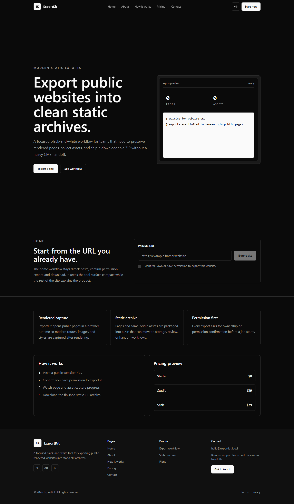
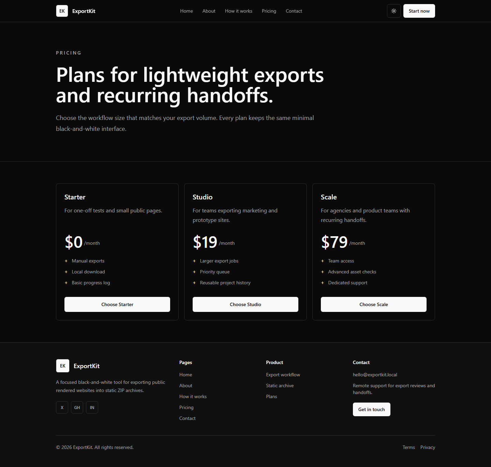
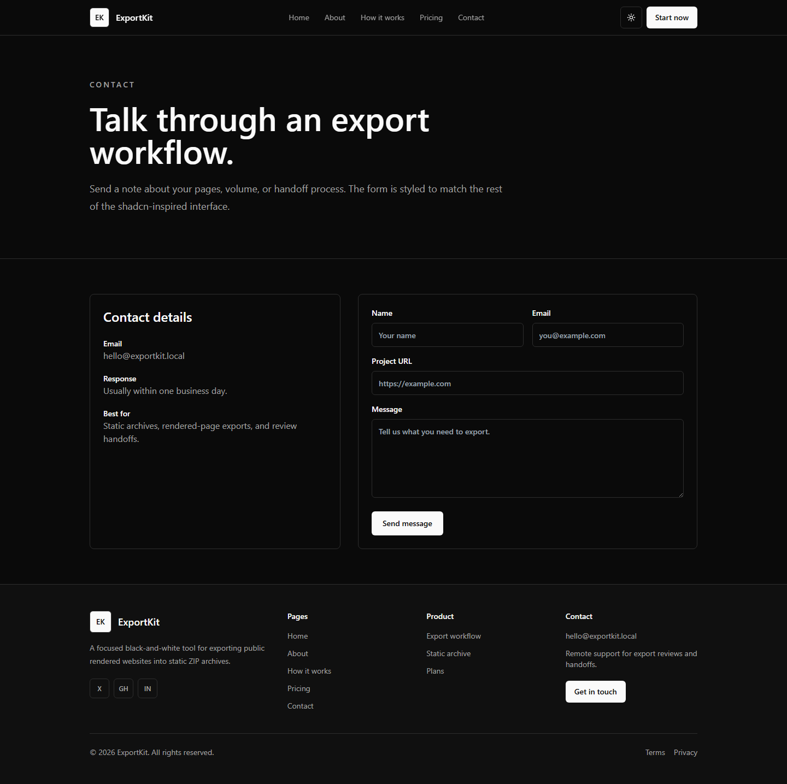

# ExportKit

ExportKit is a modern black-and-white Next.js landing website for exporting public rendered websites into static ZIP archives. It includes a shadcn-inspired interface, dark/light theme toggle, and separate pages for Home, About, How it works, Pricing, and Contact.

## Screenshots





## Pages

- `/` - Home and export workflow
- `/about` - Product overview
- `/how-it-works` - Export process
- `/pricing` - Pricing plans
- `/contact` - Contact form

## Tech Stack

- Next.js 14
- React 18
- TypeScript
- Tailwind CSS
- Playwright for rendered website export and screenshots

## Getting Started

Install dependencies:

```bash
npm install
```

Run the development server:

```bash
npm run dev
```

Open the site:

```text
http://localhost:3000
```

Build for production:

```bash
npm run build
```

Start the production server:

```bash
npm run start
```

## Generate Screenshots

Start the dev server first:

```bash
npm run dev
```

Then run:

```bash
npx tsx scripts/capture-screenshots.ts
```

Screenshots are saved to:

```text
public/screenshots
```

## Upload To A Private GitHub Repository

Create a new repository on GitHub and set visibility to **Private**.

Then run these commands from the project folder:

```bash
git init
git add .
git commit -m "Initial ExportKit website"
git branch -M main
git remote add origin https://github.com/YOUR_USERNAME/YOUR_PRIVATE_REPO.git
git push -u origin main
```

Replace `YOUR_USERNAME` and `YOUR_PRIVATE_REPO` with your GitHub username and private repository name.

## Important Privacy Note

Do not make the repository public if you want to keep the full project private. In GitHub, check the repository settings and confirm the visibility is set to **Private** before pushing or sharing the repository link.
